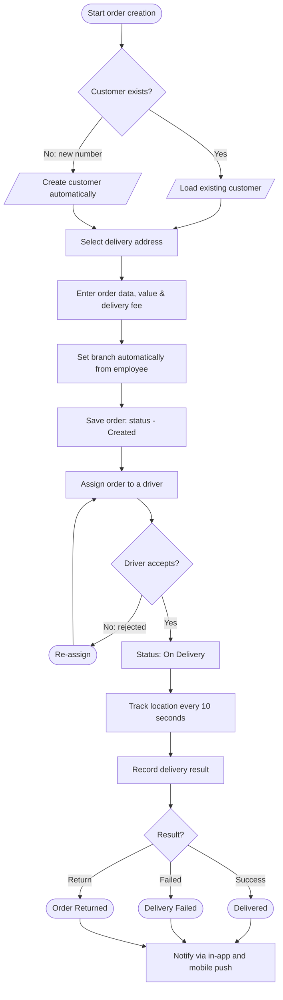
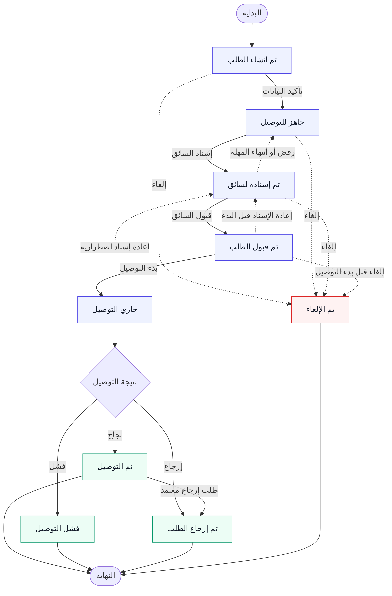

# وثيقة متطلبات النظام
## نظام إدارة ومتابعة عمليات التوصيل

| البند | القيمة |
| :--- | :--- |
| **الإصدار** | 0.2 |
| **الحالة** | مسودة أولى |
| **التاريخ** | 26/8/2026 |
| **إعداد** | م. محمد هشام |
| **المعايير** | IEEE 830-1998 |

---

## 1. مقدمة

### 1.1 الهدف من الوثيقة
تهدف هذه الوثيقة إلى توثيق متطلبات نظام إدارة ومتابعة عمليات التوصيل، وتحديد نطاق النظام، والأطراف التي تتعامل معه، والعمليات التي يدعمها، والقواعد التي تحكم عمله.

تُستخدم هذه الوثيقة كمرجع مشترك بين:
- أصحاب المشروع (Business Owners)
- أصحاب المصلحة (Stakeholders)
- فريق تطوير البرمجيات
- فريق التصميم
- فريق التشغيل

### 1.2 نطاق الوثيقة
تغطي هذه الوثيقة المتطلبات الوظيفية وغير الوظيفية للنظام، بما في ذلك:
- وصف النظام وخصائصه
- المتطلبات الوظيفية التفصيلية
- قواعد العمل وانتقالات الحالات
- المتطلبات غير الوظيفية (الأداء، الأمان، التوافر)
- واجهات النظام الخارجية
- متطلبات التكامل مع الأنظمة الخارجية

### 1.3 التعريفات والمصطلحات

| المصطلح | التعريف |
| :--- | :--- |
| **المنشأة** | الجهة التجارية التي تستخدم النظام (محل، صيدلية، مطعم، إلخ) |
| **الفرع** | موقع تابع للمنشأة يُدار بشكل مستقل |
| **الطلب** | طلب توصيل تم تسجيله في النظام |
| **السائق** | الشخص المسؤول عن تنفيذ عملية التوصيل |
| **عملية التوصيل** | تنفيذ توصيل طلب معين من الاستلام إلى التسليم |
| **المستخدم** | الشخص الذي لديه حساب في النظام ويتفاعل معه |
| **المشرف** | مالك المنشأة أو من ينوب عنه |
| **المحول** | دور متخصص لموظف المنشأة، مسؤول عن إسناد الطلبات وتوزيعها على السائقين |
| **آلة الحالة** | مخطط يوضح الحالات المسموح بها للطلب وانتقالاتها |
| **طلب متعدد** | طلب يحتوي على أكثر من عنوان توصيل (خارج النطاق حالياً) |

### 1.4 المراجع
- IEEE 830-1998: Recommended Practice for Software Requirements Specifications
- وثيقة العمل الأولية: delivery_system_initial_work.md

### 1.5 هيكل الوثيقة
- القسم 1: مقدمة
- القسم 2: الوصف العام للنظام
- القسم 3: المتطلبات الوظيفية
- القسم 4: قواعد العمل وانتقالات الحالات
- القسم 5: حالات الاستخدام وقصص المستخدم
- القسم 6: المتطلبات الواجهات الخارجية
- القسم 7: المتطلبات غير الوظيفية
- القسم 8: التكامل مع الأنظمة الخارجية
- القسم 9: القرارات المعمارية
- القسم 10: الملاحق

---

## 2. الوصف العام للنظام

### 2.1 صورة النظام (Product Perspective)
النظام عبارة عن منصة مستقلة لإدارة ومتابعة عمليات التوصيل الخاصة بالمحلات والصيدليات والمطاعم وغيرها من الأنشطة التجارية التي تعتمد على خدمات التوصيل.

> **ملاحظة:** النظام لا يشترط أن يكون مسؤولًا عن توفير السائقين؛ حيث يمكن أن يكون السائقون تابعين للمنشأة التجارية نفسها.

### 2.2 الوظائف الرئيسية للنظام

**The following flowchart shows the core operational flow, from order creation to completed delivery:**

**الوحدات الرئيسية:**
- إدارة المنشآت
- إدارة الفروع
- إدارة المستخدمين والصلاحيات
- إدارة السائقين
- إدارة العملاء
- إدارة الطلبات
- إدارة التوصيل
- التتبع اللحظي
- الإشعارات
- التقارير
- سجل العمليات

### 2.3 فئات المستخدمين وخصائصهم

#### 2.3.1 مالك المنشأة (Business Owner)
**الدور:** مسؤول عن إدارة المنشأة ومتابعة الأداء العام.

| الصلاحية | الوصف |
| :--- | :--- |
| إدارة الفروع | إنشاء، تعديل، حذف الفروع |
| إدارة الموظفين | إضافة، تعديل، حذف الموظفين وتحديد صلاحياتهم |
| إدارة السائقين | إضافة، تعديل، حذف السائقين |
| متابعة الطلبات | عرض جميع الطلبات ومتابعة حالتها |
| الاطلاع على التقارير | عرض التقارير التشغيلية والإحصائيات |

#### 2.3.2 موظف المنشأة (Employee)
**الدور:** استخدام النظام لإدارة العمليات اليومية.

| الصلاحية | الوصف |
| :--- | :--- |
| إنشاء الطلبات | إنشاء طلبات توصيل جديدة |
| تعديل الطلبات | تعديل بيانات الطلبات قبل التوصيل |
| إسناد الطلبات | إسناد الطلبات للسائقين |
| متابعة التوصيل | متابعة حالة عمليات التوصيل |

> **ملاحظة:** تختلف الصلاحيات الفعلية حسب الدور المحدد للموظف من قبل المشرف.
>
> **ملاحظة (الفروع):** يكون الموظف مرتبطًا بفرع واحد أو أكثر داخل المنشأة. يُستخدم فرع الموظف افتراضيًا عند إنشاء الطلبات، ويُختار الفرع يدويًا إذا ارتبط الموظف بأكثر من فرع أو لم يرتبط بفرع محدد (مثل المالك).

#### 2.3.3 المحول / مسؤول التشغيل (Dispatcher)
**الدور:** المحول هو **نوع متخصص من موظفي المنشأة**، وليس طرفًا مستقلاً. يُحدَّد من خلال صلاحية/دور يمنحه المشرف لموظف معين، ويتولى متابعة الطلبات وإسنادها للسائقين.

| الصلاحية | الوصف |
| :--- | :--- |
| عرض الطلبات | عرض الطلبات الجاهزة للتوصيل |
| إسناد الطلبات | إسناد الطلبات للسائقين المتاحين |
| إعادة الإسناد | نقل الطلب من سائق إلى آخر |
| متابعة التوصيل | متابعة حالة جميع الطلبات قيد التوصيل |

> **ملاحظة:** المحول قد يحمل صلاحيات الموظف الأساسية (إنشاء وتعديل الطلبات) إضافةً إلى صلاحيات الإسناد، وفقًا لإعدادات دوره في النظام.

#### 2.3.4 السائق (Driver)
**الدور:** مسؤول عن تنفيذ عملية التوصيل. قد يعمل لدى أكثر من فرع داخل المنشأة.

| الصلاحية | الوصف |
| :--- | :--- |
| مشاهدة الطلبات | عرض الطلبات المسندة إليه من الفروع المرتبط بها |
| قبول/رفض الطلب | قبول أو رفض الطلب حسب قواعد النظام |
| تحديث الحالة | تحديث حالة التوصيل (بدء، وصول، نجاح، فشل) |
| إرسال الموقع | إرسال الموقع أثناء التوصيل |
| تسجيل النتيجة | تسجيل نتيجة عملية التوصيل |

#### 2.3.5 مسؤول النظام (System Admin)
**الدور:** مسؤول عن إدارة المنصة ككل، وليس عن العمليات اليومية الخاصة بالمنشآت.

| الصلاحية | الوصف |
| :--- | :--- |
| إدارة المنشآت | إنشاء وتعديل وحذف المنشآت |
| إدارة النظام | إعدادات النظام العامة |
| متابعة الأداء | متابعة أداء النظام العام |
| سجل العمليات | الاطلاع على سجل العمليات الحساسة |

### 2.4 بيئة التشغيل

| البند | المتطلبات |
| :--- | :--- |
| **إطار العمل (Backend)** | Laravel (PHP) |
| **الخادم** | نظام تشغيل Linux، Nginx كخادم ويب |
| **قاعدة البيانات** | PostgreSQL |
| **الاتصال** | اتصال HTTPS آمن |
| **الأجهزة** | هاتف ذكي للسائق (Android/iOS)، متصفح ويب للمستخدمين |
| **الإنترنت** | اتصال بالإنترنت مستقر للسائقين والمستخدمين |

### 2.5 القيود التصميمية والتنفيذية
- يجب أن يدعم النظام تعدد المنشآت (Multi-Tenancy)
- يجب أن يوفر النظام REST API
- يجب أن يدعم التطبيق اللحظي للتتبع
- يجب أن يكون النظام قابلاً للتوسع أفقياً
- يجب أن يدعم النظام اللغة العربية بشكل أساسي

### 2.6 الافتراضات والتبعيات
- كل سائق تابع لمنشأة محددة
- يمكن للسائق أن يعمل لدى أكثر من فرع داخل نفس المنشأة
- المنشأة مسؤولة عن توفير السائقين
- الطلب يتم إنشاؤه بواسطة المنشأة
- العميل ليس بالضرورة مستخدمًا للنظام
- السائق يمتلك هاتفًا ذكيًا متصلًا بالإنترنت
- النظام يعتمد على خدمات خارجية للخرائط والرسائل

---

## 3. المتطلبات الوظيفية

### 3.1 إدارة المنشآت

#### FR-001: إنشاء منشأة جديدة
**الأولوية:** حرجة

**الوصف:**
يستطيع مسؤول النظام إنشاء منشأة تجارية جديدة في النظام.

**البيانات المطلوبة:**
- اسم المنشأة
- رقم الهاتف
- العنوان
- نوع النشاط (محل، صيدلية، مطعم، إلخ)
- البريد الإلكتروني (اختياري)

**قواعد العمل:**
- يجب أن يكون اسم المنشأة فريداً
- يجب أن يكون رقم الهاتف صحيحاً
- يحصل المنشأة على رقم تعريف فريد
- تُسجَّل تاريخ الإنشاء تلقائيًا

**معيار القبول:**
1. يتم إنشاء المنشأة بنجاح
2. تحصل المنشأة على رقم فريد
3. تُسجَّل تاريخ الإنشاء
4. تظهر المنشأة في قائمة المنشآت

---

#### FR-002: تعديل بيانات المنشأة
**الأولوية:** عالية

**الوصف:**
يستطيع مسؤول النظام تعديل بيانات المنشأة.

**البيانات القابلة للتعديل:**
- اسم المنشأة
- رقم الهاتف
- العنوان
- نوع النشاط

**قواعد العمل:**
- لا يمكن حذف المنشأة إذا كان بها طلبات نشطة
- تُسجَّل جميع التغييرات في سجل العمليات

**معيار القبول:**
1. يتم تعديل البيانات بنجاح
2. تُسجَّل التغييرات في سجل العمليات
3. لا تتأثر الطلبات النشطة بالتغييرات

---

#### FR-003: عرض قائمة المنشآت
**الأولوية:** عالية

**الوصف:**
يستطيع مسؤول النظام عرض جميع المنشآت المسجلة في النظام.

**معايير العرض:**
- قائمة بجميع المنشآت مع البيانات الأساسية
- إمكانية البحث بالاسم أو رقم الهاتف
- إمكانية التصفية حسب نوع النشاط

**معيار القبول:**
1. تظهر جميع المنشآت في قائمة
2. يعمل البحث بشكل صحيح
3. تعمل التصفية بشكل صحيح

---

#### FR-041: تعطيل أو حذف منشأة
**الأولوية:** عالية

يستطيع مسؤول النظام تعطيل المنشأة بعد إيقاف إنشاء الطلبات الجديدة ومعالجة طلباتها النشطة. يؤدي التعطيل إلى منع تسجيل دخول مستخدمي المنشأة وإسناد طلبات جديدة مع إبقاء البيانات التاريخية. لا تُحذف المنشأة نهائيًا إذا ارتبطت بطلبات أو سجلات عمليات، وتُسجَّل العملية وسببها وهوية منفذها.

---

### 3.2 إدارة الفروع

#### FR-004: إنشاء فرع جديد
**الأولوية:** حرجة

**الوصف:**
يستطيع مالك المنشأة أو مسؤول النظام إنشاء فرع جديد تابع لمنشأة.

**البيانات المطلوبة:**
- اسم الفرع
- العنوان
- رقم الهاتف
- المنشأة التابع لها

**قواعد العمل:**
- يجب أن يكون الفرع تابعاً لمنشأة موجودة
- يجب أن يكون اسم الفرع فريداً داخل المنشأة
- يحصل الفرع على رقم تعريف فريد

**معيار القبول:**
1. يتم إنشاء الفرع بنجاح
2. يحصل الفرع على رقم فريد
3. يظهر الفرع في قائمة فروع المنشأة

---

#### FR-005: تعديل بيانات الفرع
**الأولوية:** عالية

**الوصف:**
يستطيع مالك المنشأة تعديل بيانات الفرع.

**البيانات القابلة للتعديل:**
- اسم الفرع
- العنوان
- رقم الهاتف

**معيار القبول:**
1. يتم تعديل البيانات بنجاح
2. تُسجَّل التغييرات في سجل العمليات

---

#### FR-038: تعطيل أو حذف فرع
**الأولوية:** عالية

يستطيع مالك المنشأة تعطيل الفرع، ولا يجوز حذفه نهائيًا إذا ارتبط بطلبات أو سجلات تشغيلية. يمنع التعطيل إنشاء طلبات جديدة للفرع أو إسنادها إليه، مع إبقاء بياناته التاريخية قابلة للعرض. يجب نقل الطلبات النشطة أو إكمالها قبل التعطيل، وتُسجَّل العملية في سجل العمليات.

---

### 3.3 إدارة المستخدمين والصلاحيات

#### FR-006: إضافة مستخدم جديد
**الأولوية:** حرجة

**الوصف:**
يستطيع مالك المنشأة إضافة مستخدم جديد (موظف) للنظام.

**البيانات المطلوبة:**
- الاسم الكامل
- البريد الإلكتروني
- رقم الهاتف
- الدور (موظف، محول)
- المنشأة التابع لها
- الفروع التابع لها (فرع واحد أو أكثر، إلزامي فرع واحد على الأقل)

> **ملاحظة (الفروع):** يرتبط الموظف بفرع واحد أو أكثر. يُحدَّد فرع الطلب تلقائيًا من فرع الموظف عند إنشاء الطلب. إذا ارتبط الموظف بأكثر من فرع، يمكنه اختيار الفرع عند إنشاء الطلب (انظر FR-015).
>
> **ملاحظة أمنية:** لا يُدخل المدير كلمة مرور الموظف أبدًا. يحدد الموظف كلمة مروره بنفسه من خلال رابط دعوة آمن يُرسل إلى بريده.

**قواعد العمل:**
- يجب أن يكون البريد الإلكتروني فريداً
- يجب أن يكون المستخدم تابعاً لمنشأة واحدة على الأقل
- يُنشَأ الحساب بحالة **غير مفعلة** حتى يفعّله الموظف بنفسه
- لا تُنشأ أي كلمة مرور في هذه المرحلة

**سير العمل (Flow):**
1. يفتح مالك المنشأة صفحة إضافة موظف.
2. يُدخل بيانات الموظف (الاسم، البريد، الهاتف، الدور، المنشأة، الفروع) **دون كلمة مرور**.
3. يضغط "إنشاء الحساب".
4. يتحقق النظام من فريدية البريد الإلكتروني.
5. يُنشَأ الحساب بحالة **غير مفعلة**، دون أي كلمة مرور.
6. يُرسل النظام رابط دعوة آمن (برمز لمرة واحدة وصالح لفترة محددة) إلى **البريد الإلكتروني** للموظف.
7. يفتح الموظف الرابط ويُدخل **كلمة مرور من اختياره** (تخضع لشروط القوة).
8. يُفعَّل الحساب تلقائيًا بعد ضبط كلمة المرور.
9. بعدها يتمكن الموظف من تسجيل الدخول باستخدام بريده وكلمة المرور التي اختارها.

**معيار القبول:**
1. يتم إنشاء الحساب بنجاح دون كلمة مرور
2. يحصل المستخدم على رقم فريد
3. تُسجَّل تاريخ الإنشاء
4. لا يمكن تسجيل الدخول حتى يضبط الموظف كلمة مروره ويفعّل حسابه
5. رابط الدعوة صالح لمرة واحدة فقط ولصالح فترة زمنية محددة
6. لا يظهر الموظف كخيار في إسناد الطلبات قبل التفعيل

---

#### FR-007: تعديل صلاحيات المستخدم
**الأولوية:** عالية

**الوصف:**
يستطيع مالك المنشأة تعديل صلاحيات المستخدم.

**البيانات القابلة للتعديل:**
- الدور
- الحالة (مفعل، غير مفعل)
- الفروع التابعة (إضافة/إزالة فروع)

**قواعد العمل:**
- لا يمكن للمستخدم تعديل صلاحياته بنفسه
- لا يمكن تغيير دور المستخدم الأخير الذي يملك صلاحيات المشرف
- يجب بقاء الموظف مرتبطًا بفرع واحد على الأقل
- تُسجَّل جميع التغييرات في سجل العمليات

**معيار القبول:**
1. يتم تعديل الصلاحيات بنجاح
2. تُسجَّل التغييرات في سجل العمليات
3. تؤثر التغييرات فوراً على صلاحيات المستخدم

---

#### FR-008: تسجيل الدخول والخروج
**الأولوية:** حرجة

**الوصف:**
يستطيع المستخدم تسجيل الدخول إلى النظام باستخدام بريده الإلكتروني وكلمة المرور.

**قواعد العمل:**
- يجب أن يكون البريد الإلكتروني وكلمة المرور صحيحين
- يتم قفل الحساب بعد 5 محاولات فاشلة
- تنتهي الجلسة بعد 30 دقيقة من عدم النشاط
- يجب تسجيل جميع محاولات الدخول في سجل العمليات

**معيار القبول:**
1. يتم تسجيل الدخول بنجاح
2. تُنشَأ جلسة مستخدم آمنة
3. تُسجَّل محاولة الدخول في سجل العمليات
4. يتم قفل الحساب بعد 5 محاولات فاشلة

---

#### FR-039: تعطيل أو حذف مستخدم
**الأولوية:** عالية

يستطيع مالك المنشأة تعطيل حساب الموظف فورًا وإبطال جلساته ورموز الوصول الخاصة به. لا يُحذف الحساب نهائيًا إذا كان مرتبطًا بسجل عمليات أو طلبات، ولا يجوز تعطيل آخر مستخدم يملك صلاحيات المشرف. تُسجَّل العملية وسببها في سجل العمليات.

---

### 3.4 إدارة السائقين

#### FR-009: إضافة سائق جديد
**الأولوية:** حرجة

**الوصف:**
يستطيع مالك المنشأة إضافة سائق جديد للنظام.

**البيانات المطلوبة:**
- الاسم الكامل
- رقم الهاتف
- الفروع التابع لها (فرع واحد أو أكثر)
- وسيلة التوصيل (دراجة، دراجة نارية، سيارة)
- حالة السائق (نشط، غير نشط، موقوف)
- الحد الأقصى للطلبات النشطة بالتزامن (اختياري؛ تُستخدم قيمة المنشأة الافتراضية عند عدم تحديده)

**قواعد العمل:**
- يجب أن يكون السائق تابعاً لمنشأة واحدة فقط
- يجب أن يكون السائق تابعاً لفرع واحد أو أكثر داخل المنشأة
- يجب أن تكون جميع الفروع التابعة له تابعة لنفس المنشأة
- يجب أن يكون رقم الهاتف فريداً
- تبدأ حالة السائق بـ"نشط" عند الإضافة
- يحصل السائق على رقم تعريف فريد

**معيار القبول:**
1. يتم إضافة السائق بنجاح
2. يحصل السائق على رقم فريد
3. تبدأ الحالة بـ"نشط"
4. تُسجَّل تاريخ الإضافة
5. يمكن ربط السائق بأكثر من فرع
6. لا يمكن ربط السائق بفروع من منشآت مختلفة

---

#### FR-010: تعديل بيانات السائق
**الأولوية:** عالية

**الوصف:**
يستطيع مالك المنشأة تعديل بيانات السائق.

**البيانات القابلة للتعديل:**
- الاسم الكامل
- رقم الهاتف
- الفروع التابعة (إضافة/إزالة فروع)
- وسيلة التوصيل
- الحالة
- الحد الأقصى للطلبات النشطة بالتزامن

**قواعد العمل:**
- لا يمكن تغيير المنشأة التابع لها السائق إذا كان لديه طلبات نشطة
- يمكن إضافة أو إزالة فروع للسائق، بشرط أن تبقى جميع الفروع تابعة لنفس المنشأة
- لا يمكن إزالة الفرع من السائق إذا كان لديه طلبات نشطة في ذلك الفرع
- تُسجَّل جميع التغييرات في سجل العمليات

**معيار القبول:**
1. يتم تعديل البيانات بنجاح
2. تُسجَّل التغييرات في سجل العمليات
3. لا تتأثر الطلبات النشطة بالتغييرات

---

#### FR-011: عرض حالة السائق
**الأولوية:** عالية

**الوصف:**
يستطيع المحول أو المشرف عرض حالة السائق الحالية.

**المعلومات المعروضة:**
- الاسم
- الحالة (نشط، غير نشط، موقوف)
- الحالة التشغيلية (متاح، مشغول جزئياً، مكتمل السعة)
- الفروع المرتبط بها
- الموقع الحالي (إذا كان متاحاً)
- عدد الطلبات النشطة

**معيار القبول:**
1. تظهر الحالة الحالية للسائق
2. يتم تحديث الحالة تلقائياً
3. يظهر الموقع إذا كان السائق نشطاً

---

#### FR-040: تعطيل أو حذف سائق
**الأولوية:** عالية

يستطيع مالك المنشأة تعطيل السائق، ولا يجوز تعطيله قبل إعادة إسناد طلباته النشطة أو إكمالها. لا يُحذف السائق نهائيًا إذا ارتبط بطلبات أو سجلات تتبع، ويُمنع من قبول إسنادات جديدة فور التعطيل. تُسجَّل العملية في سجل العمليات.

---

### 3.5 إدارة العملاء

> **الغرض من إدارة العملاء:** العميل **ليس مستخدمًا** للنظام (لا يملك حسابًا ولا يسجّل دخولًا). يُحفظ ملف العميل داخل المنشأة لغرضين:
> 1. **تسريع إنشاء الطلب:** بمجرد كتابة رقم الهاتف يُستحضر ملف العميل تلقائيًا (الاسم وقائمة عناوينه) دون أي تنقل بين الشاشات أو إعادة كتابة.
> 2. **توفير التاريخ والإحصائيات:** الاحتفاظ بسجل طلبات العميل للاستخدام المستقبلي (إعادة التوصيل، المتابعة، التقارير).
>
> **السيناريو الشائع (أفضل ممارسة):** لا يُجبر الموظف على إنشاء عميل من شاشة منفصلة قبل إنشاء الطلب. يتم كل شيء من شاشة إنشاء الطلب: يُدخل رقم الهاتف فحسب، والنظام يبحث تلقائيًا — إن وُجد العميل يملأ بياناته وقد يختار من قائمة عناوينه، وإن لم يوجد ينشئه تلقائيًا (عند حفظ الطلب).

#### FR-012: إنشاء عميل (يدوي أو تلقائي)
**الأولوية:** عالية

**الوصف:**
يُحفظ ملف العميل في النظام إما **يدويًا** (من شاشة إدارة العملاء) أو **تلقائيًا** أثناء إنشاء الطلب عندما لا يوجد عميل بنفس الرقم. من منظور المستخدم، لا حاجة للتنقل إلى شاشة العملاء قبل الطلب.

**البيانات المطلوبة:**
- رقم الهاتف (إلزامي، ومعيار البحث الأساسي)
- الاسم الكامل (إلزامي)
- قائمة العناوين (عنوان واحد أو أكثر، لكل عنوان نوع/تسمية اختيارية مثل: منزل، عمل، أقارب)
- العنوان الافتراضي (يُحدَّد من القائمة، اختياري، ويُستخدم كقيمة أولية عند إنشاء الطلب)
- ملاحظات (اختياري)

**قواعد العمل:**
- يجب أن يكون رقم الهاتف فريداً داخل المنشأة
- يُدار ملف العميل على مستوى المنشأة (عزل بيانات العملاء بين المنشآت وفق BR-001)
- يُحفظ للعميل قائمة عناوين متعددة، يتولى **المستخدم/الموظف** إدارتها (إضافة وتعديل وحذف) بالنيابة عن العميل، لأن العميل لا يستخدم النظام
- يجوز تحديد عنوان واحد من القائمة كـ**عنوان افتراضي/مفضل**؛ ويمكن تركه دون تحديد
- عند إنشاء الطلب: إذا أدخل الموظف رقم هاتف لا يوجد له عميل، يُنشأ العميل **تلقائيًا** مع حفظ الطلب (لا تُطلب شاشة منفصلة)
- يحصل العميل على رقم تعريف فريد

**سير العمل (Flow):**
1. **إنشاء يدوي:** يفتح المستخدم شاشة إدارة العملاء ويُدخل البيانات والعناوين، ثم يُحفظ الملف.
2. **إنشاء تلقائي:** أثناء إنشاء الطلب، يُدخل الموظف رقم هاتف جديدًا — يُنشأ ملف العميل تلقائيًا عند حفظ الطلب (يُخزَّن عنوان الطلب كأول عنوان له إن أُدخل).
3. في الحالتين، يُستخدم الملف مستقبلاً في الطلبات اللاحقة دون إعادة إدخال.

**معيار القبول:**
1. يتم إنشاء العميل بنجاح (يدويًا أو تلقائيًا)
2. يحصل العميل على رقم فريد
3. تظهر بيانات العميل في قائمة العملاء
4. عند إنشاء الطلب برقم هاتف غير موجود، يُنشأ العميل تلقائيًا دون الحاجة لشاشة منفصلة
5. يُستحضر العميل تلقائيًا عند إدخال رقم هاتفه في أي طلب لاحق
6. يُحفظ للعميل أكثر من عنوان، مع إمكانية تحديد عنوان افتراضي (تُدار هذه البيانات من المستخدم/الموظف)

---

#### FR-013: تعديل بيانات العميل
**الأولوية:** عالية

**الوصف:**
يستطيع المستخدم المخول تعديل البيانات الأساسية للعميل.

**البيانات القابلة للتعديل:**
- الاسم الكامل
- رقم الهاتف
- قائمة العناوين (إضافة عنوان جديد، تعديل عنوان، حذف عنوان، تحديد عنوان افتراضي)
- ملاحظات

**قواعد العمل:**
- تُعدَّل البيانات في ملف العميل دون المساس بمحتوى الطلبات السابقة أو النشطة
- عناوين التوصيل في الطلبات محفوظة كسجلات خاصة بكل طلب ولا تتغيّر عند تعديل قائمة عناوين العميل
- يجوز إضافة/تعديل/حذف أي عنوان من القائمة، مع إمكانية تحديد عنوان واحد كافتراضي
- عند حذف العنوان الافتراضي، إما يُحدَّد عنوان افتراضي آخر أو يُترك دون تحديد
- لا يُحذف عنوان يستخدم في طلب نشط (قيد التوصيل) إلا بعد اكتمال/إلغاء ذلك الطلب

**معيار القبول:**
1. يتم تعديل البيانات بنجاح
2. تُسجَّل التغييرات في سجل العمليات
3. لا تتأثر الطلبات السابقة أو النشطة ببيانات التوصيل الخاصة بها
4. عند إنشاء طلب لاحق، تُعرض القائمة الحالية للعناوين مع عنوان التوصيل الصحيح لكل طلب
5. يمكن إضافة وتعديل وحذف وتحديد عنوان افتراضي من قائمة العناوين

---

#### FR-014: البحث عن عميل
**الأولوية:** متوسطة

**الوصف:**
يستطيع المستخدم البحث عن عميل بالاسم أو رقم الهاتف.

**معايير البحث:**
- بحث برقم الهاتف (المعيار الأساسي، يُستخدم تلقائيًا عند إنشاء الطلب - انظر FR-015)
- بحث بالاسم (جزئي أو كامل)
- بحث بالعنوان

**معيار القبول:**
1. تظهر النتائج بشكل فوري
2. تعمل البحث بجميع المعايير
3. تظهر النتائج بشكل مناسب

---

### 3.6 إدارة الطلبات

#### FR-015: إنشاء طلب توصيل
**الأولوية:** حرجة

**الوصف:**
يستطيع المستخدم المخول إنشاء طلب توصيل جديد، عبر كتابة رقم هاتف العميل فقط حيث يقوم النظام بالبحث التلقائي وملء البيانات — دون الحاجة إلى إنشاء عميل مسبقًا أو التنقل إلى شاشة العملاء.

**البيانات المطلوبة:**
| الحقل | المصدر | الوصف |
| :--- | :--- | :--- |
| رقم الهاتف | إدخال يدوي | نقطة البداية؛ يُبحث عنه تلقائيًا |
| الاسم | ملء تلقائي | يُعبَّأ تلقائيًا من ملف العميل إن وُجد، أو يُدخله الموظف لعميل جديد |
| عنوان التوصيل | اختيار من القائمة | يُختار من **قائمة عناوين العميل** (أو إضافة عنوان جديد) |
| بيانات الطلب | إدخال يدوي | الوصف والكمية |
| قيمة الطلب | إدخال يدوي | قيمة الطلب بالعملة |
| رسوم التوصيل | إدخال يدوي | تكلفة التوصيل |
| الفرع المسؤول | ملء تلقائي (قابل للتعديل) | يُحدَّد تلقائيًا من فرع المستخدم الحالي إن ارتبط بفرع واحد، ويُختار من القائمة إن ارتبط بأكثر من فرع أو لم يرتبط |
| ملاحظات | إدخال يدوي | اختياري |

**قواعد العمل:**
- يجب أن يكون الطلب مربوطاً بمنشأة صاحب المستخدم
- يُبحث عن العميل تلقائيًا برقم الهاتف فور إدخاله:
  - **إن وُجد عميل بنفس الرقم** → تُملأ بياناته (الاسم، قائمة عناوينه) تلقائيًا ولا تُعاد كتابتها.
  - **إن لم يوجد** → يُنشأ العميل تلقائيًا (مع الاسم الذي أدخله الموظف) عند حفظ الطلب، دون شاشة منفصلة.
- يُختار عنوان التوصيل من **قائمة عناوين العميل**؛ وإن لم يوجد عنوان مناسب يمكن إضافة عنوان جديد إلى قائمة العميل أثناء إنشاء الطلب
- عنوان التوصيل هو **سجل خاص بهذا الطلب** يُحفظ معه (لقطة)، وقد يختلف عمّا هو موجود حاليًا في قائمة عناوين العميل
- الفرع المسؤول يُحدَّد **تلقائيًا من فرع المستخدم الحالي** إذا ارتبط المستخدم بفرع واحد، ولا يُطلب منه اختياره في كل طلب
- إذا ارتبط المستخدم بأكثر من فرع، يختار الفرع من قائمة فروعه المرتبطة
- إذا لم يرتبط المستخدم بفرع محدد (مثل مالك المنشأة أو مسؤول يتابع كل الفروع)، يختار الفرع من قائمة فروع المنشأة
- يجب أن يكون الفرع موجوداً ونشطًا
- يحصل الطلب على رقم تعريف فريد
- تُسجَّل تاريخ الإنشاء تلقائيًا
- تبدأ الحالة بـ"تم إنشاء الطلب"

**سير العمل (Flow):**
1. يبدأ المستخدم بإنشاء طلب جديد و**يكتب رقم هاتف العميل**.
2. يبحث النظام تلقائيًا:
   - عميل موجود → تُملأ بياناته وقائمة عناوينه تلقائيًا.
   - عميل غير موجود → يبقى الحقل فارغًا ليقوم الموظف بإدخال الاسم (يُحفظ العميل تلقائيًا عند حفظ الطلب).
3. يختار الموظف **عنوان التوصيل** من قائمة عناوين العميل؛ وإن لم يوجد عنوان مناسب يضيف الموظف عنوانًا جديدًا إلى قائمة العميل (يُحدَّث الملف بهذا العنوان بالنيابة عن العميل).
4. يُدخل بيانات الطلب والقيمة ورسوم التوصيل؛ ويُسجَّل فرع الطلب تلقائيًا من فرع المستخدم الحالي إن كان مرتبطًا بفرع واحد (ويُختار من قائمة فروعه إن كان مرتبطًا بأكثر من فرع أو من كل الفروع إن لم يكن مرتبطًا).
5. يحفظ الطلب — فيُسجَّل رقم الطلب والتاريخ، وتُحدَّد الحالة "تم إنشاء الطلب"، ويُحفظ العميل الجديد تلقائيًا (مع عنوانه الأول) إن كان جديدًا.

**معيار القبول:**
1. بمجرد إدخال رقم هاتف عميل موجود، تُملأ بياناته وقائمة عناوينه تلقائيًا دون إعادة كتابة
2. عند إدخال رقم هاتف جديد، يُنشأ العميل تلقائيًا مع حفظ الطلب (بدون شاشة عملاء منفصلة)
3. يتم اختيار عنوان التوصيل من قائمة عناوين العميل، مع إمكانية إضافة عنوان جديد أثناء إنشاء الطلب
4. يحصل الطلب على رقم فريد
5. تُسجَّل تاريخ الإنشاء وتظهر في سجل الطلب
6. تبدأ الحالة بـ"تم إنشاء الطلب"
7. يُحفظ عنوان التوصيل الخاص بالطلب (كلقطة) حتى لو تغيّرت قائمة عناوين العميل لاحقًا
8. يتم تعديل الاسم/الهاتف من ملف العميل (FR-013) ولا يُغيَّر من الطلب بعد إنشائه
9. يُسجَّل فرع الطلب تلقائيًا من فرع المستخدم الحالي دون أن يختاره في كل طلب (عند ارتباطه بفرع واحد)

---

#### FR-037: تأكيد جاهزية الطلب للتوصيل
**الأولوية:** حرجة

**الوصف:**
يستطيع الموظف المخول أو المحول تأكيد اكتمال بيانات الطلب ونقله من "تم إنشاء الطلب" إلى "جاهز للتوصيل".

**قواعد العمل ومعايير القبول:**
1. لا يتم التأكيد إلا إذا اكتملت بيانات العميل والعنوان والفرع وقيمة الطلب ورسوم التوصيل.
2. تُسجَّل هوية المستخدم ووقت التأكيد في سجل الطلب.
3. لا يظهر الطلب ضمن قائمة الإسناد قبل وصوله إلى "جاهز للتوصيل".
4. تؤدي العملية الناجحة إلى الحالة "جاهز للتوصيل" مرة واحدة فقط.

---

#### FR-016: تعديل طلب
**الأولوية:** عالية

**الوصف:**
يستطيع المستخدم المخول تعديل بيانات الطلب قبل التوصيل.

**البيانات القابلة للتعديل (في الطلب فقط):**
- عنوان التوصيل الخاص بالطلب
- بيانات الطلب (الوصف، الكمية)
- قيمة الطلب
- رسوم التوصيل
- الفرع المسؤول
- ملاحظات

**ما لا يُعدَّل من الطلب:**
- العميل المرتبط بالطلب (تُعدَّل بياناته من ملف العميل في FR-013 ولا تُغيَّر في الطلب)

**قواعد العمل:**
- لا يتم تعديل ملف العميل عند تعديل الطلب؛ إذا كان الاسم/الهاتف بحاجة لتصحيح يُعدَّل من ملف العميل
- لا يمكن تعديل الطلب بعد إسناده لسائق
- لا يمكن تعديل الطلب بعد بدء التوصيل
- تُسجَّل جميع التغييرات في سجل الطلب

**معيار القبول:**
1. يتم تعديل بيانات الطلب بنجاح
2. تُسجَّل التغييرات في سجل الطلب
3. لا يمكن التعديل بعد الإسناد
4. لا تتأثر بيانات ملف العميل عند تعديل الطلب

---

#### FR-017: إلغاء طلب
**الأولوية:** عالية

**الوصف:**
يستطيع المستخدم المخول إلغاء الطلب وفقاً للقواعد.

**قواعد العمل:**
- لا يمكن إلغاء الطلب بعد بدء التوصيل
- لا يمكن إلغاء الطلب المكتمل
- يجب تحديد سبب الإلغاء
- تُسجَّل عملية الإلغاء في سجل الطلب
- يتم إخطار السائق إذا كان الطلب مسندًا إليه

**معيار القبول:**
1. يتم إلغاء الطلب بنجاح
2. تُسجَّل العملية في سجل الطلب
3. يتم إخطار السائق إذا كان مسندًا إليه
4. تظهر الحالة بـ"تم الإلغاء"

---

#### FR-018: عرض تفاصيل الطلب
**الأولوية:** عالية

**الوصف:**
يستطيع المستخدم عرض تفاصيل الطلب الكاملة.

**المعلومات المعروضة:**
- رقم الطلب
- بيانات العميل (الاسم، رقم الهاتف)
- عنوان التوصيل الخاص بالطلب
- بيانات الطلب
- قيمة الطلب
- رسوم التوصيل
- الحالة الحالية
- السائق (إذا كان مسندًا)
- تاريخ الإنشاء
- سجل التغييرات

**معيار القبول:**
1. تظهر جميع بيانات الطلب
2. تظهر الحالة الحالية
3. يظهر سجل التغييرات

---

#### FR-019: البحث عن طلب
**الأولوية:** عالية

**الوصف:**
يستطيع المستخدم البحث عن طلب بالرقم أو بيانات العميل.

**معايير البحث:**
- بحث برقم الطلب
- بحث بالاسم العميل
- بحث برقم هاتف العميل
- بحث بالحالة

**معيار القبول:**
1. تظهر النتائج بشكل فوري
2. تعمل البحث بجميع المعايير
3. تظهر النتائج بشكل مناسب

---

#### FR-020: تصفية الطلبات
**الأولوية:** عالية

**الوصف:**
يستطيع المستخدم تصفية الطلبات حسب معايير مختلفة.

**معايير التصفية:**
- الحالة
- الفرع
- السائق
- التاريخ
- القيمة

**معيار القبول:**
1. تعمل جميع معايير التصفية
2. يمكن دمج معايير التصفية
3. تظهر النتائج بشكل صحيح

---

### 3.7 إدارة التوصيل

#### FR-021: إسناد الطلب إلى سائق
**الأولوية:** حرجة

**الوصف:**
يستطيع المحول أو المشرف إسناد الطلب إلى أحد السائقين المؤهلين.

**قواعد العمل:**
- يجب أن يكون السائق تابعاً للمنشأة
- يجب أن يكون السائق مرتبطاً بفرع الطلب (من ضمن فروع السائق المعتمدة)
- يجب أن يكون السائق نشطاً
- يجب ألا يكون السائق قد بلغ الحد الأقصى للطلبات النشطة وفق BR-007
- يجب أن يكون الطلب في حالة تسمح بالإسناد
- لا يمكن إسناد الطلب إلى سائق من منشأة أخرى

**عند نجاح عملية الإسناد:**
1. يتم تسجيل السائق المسؤول عن الطلب
2. يتم تسجيل وقت الإسناد
3. يتم إخطار السائق
4. يتم تسجيل العملية في سجل العمليات
5. تتحول الحالة إلى "تم إسناده لسائق"

**معيار القبول:**
1. يتم تسجيل عملية الإسناد
2. يتم ربط الطلب بالسائق
3. يتم تسجيل وقت الإسناد
4. يتم إخطار السائق
5. لا يمكن تنفيذ نفس عملية الإسناد مرتين
6. تظهر العملية في سجل الطلب

---

#### FR-022: قبول الطلب بواسطة السائق
**الأولوية:** حرجة

**الوصف:**
يستطيع السائق قبول الطلب المسند إليه.

**قواعد العمل:**
- يمكن للسائق قبول الطلب خلال 30 ثانية
- عند القبول، تتحول الحالة إلى "تم قبول الطلب"
- يتم إخطار المحول بالقبول
- تُسجَّل عملية القبول في سجل الطلب

**معيار القبول:**
1. يتم قبول الطلب بنجاح
2. تتحول الحالة إلى "تم قبول الطلب"
3. يتم إخطار المحول
4. تظهر العملية في سجل الطلب

---

#### FR-023: رفض الطلب بواسطة السائق
**الأولوية:** عالية

**الوصف:**
يستطيع السائق رفض الطلب المسند إليه.

**قواعد العمل:**
- يجب تحديد سبب الرفض
- يتم إخطار المحول بالرفض
- يمكن للمحول إعادة إسناد الطلب لسائق آخر
- تُسجَّل عملية الرفض في سجل الطلب

**معيار القبول:**
1. يتم رفض الطلب بنجاح
2. يتم إخطار المحول بالرفض
3. يمكن إعادة الإسناد
4. تظهر العملية في سجل الطلب

---

#### FR-024: إعادة إسناد الطلب
**الأولوية:** عالية

**الوصف:**
يستطيع المحول إعادة إسناد الطلب إلى سائق آخر.

**قواعد العمل:**
- يمكن إعادة الإسناد إذا رفض السائق الطلب أو انتهت مهلة القبول أو تعذر عليه الاستمرار
- يمكن إعادة الإسناد قبل بدء التوصيل أو بعده
- إذا بدأت عملية التوصيل، يجب تحديد سبب إعادة الإسناد، وإيقاف مسؤولية السائق السابق عن إرسال الموقع، وحفظ آخر موقع له، وإخطار السائقين السابق والجديد
- بعد إعادة الإسناد تصبح الحالة "تم إسناده لسائق"، ويجب أن يقبل السائق الجديد الطلب ويبدأ التوصيل من جديد
- لا تُحذف سجلات السائق السابق أو أوقات الإسناد والتتبع
- تُسجَّل عملية إعادة الإسناد في سجل الطلب

**معيار القبول:**
1. يتم إعادة الإسناد بنجاح
2. يتم إخطار السائق الجديد
3. تظهر العملية في سجل الطلب
4. عند إعادة الإسناد بعد بدء التوصيل، تنتقل مسؤولية الطلب والتتبع بوضوح إلى السائق الجديد مع الاحتفاظ بالسجل السابق

---

#### FR-025: بدء عملية التوصيل
**الأولوية:** حرجة

**الوصف:**
يستطيع السائق تسجيل بدء عملية التوصيل.

**البيانات المسجلة:**
- وقت بدء التوصيل
- الموقع الحالي

**قواعد العمل:**
- يجب أن يكون الطلب مسندًا للسائق
- يجب أن يكون السائق قد قبل الطلب
- يجب أن يكون الطلب في حالة "تم قبول الطلب"
- تبدأ عملية إرسال الموقع كل 10 ثوانٍ

**معيار القبول:**
1. يتم تسجيل وقت بدء التوصيل
2. يبدأ إرسال الموقع
3. تظهر الحالة بـ"جاري التوصيل"

---

#### FR-026: تسجيل الوصول
**الأولوية:** عالية

**الوصف:**
يستطيع السائق تسجيل وصوله إلى عنوان التوصيل.

**البيانات المسجلة:**
- وقت الوصول
- الموقع الحالي

**معيار القبول:**
1. يتم تسجيل وقت الوصول
2. تظهر العملية في سجل الطلب

---

#### FR-027: تسجيل نتيجة التوصيل
**الأولوية:** حرجة

**الوصف:**
يستطيع السائق تسجيل نتيجة عملية التوصيل.

**النتائج الممكنة:**
- تم التوصيل بنجاح
- فشل التوصيل (مع تحديد السبب)
- تم إرجاع الطلب

**البيانات المطلوبة:**
- النتيجة
- سبب الفشل (إذا كانت النتيجة فشل)
- ملاحظات (اختياري)

**قواعد العمل:**
- يجب تحديد النتيجة بشكل واضح
- يجب تحديد السبب في حالة الفشل
- تُسجَّل النتيجة في سجل الطلب
- تنتهي عملية إرسال الموقع

**معيار القبول:**
1. يتم تسجيل النتيجة بنجاح
2. تُسجَّل في سجل الطلب
3. تنتهي عملية إرسال الموقع
4. تظهر الحالة النهائية

---

### 3.8 تتبع السائقين

#### FR-028: إرسال موقع السائق
**الأولوية:** حرجة

**الوصف:**
يقوم النظام باستقبال وتسجيل موقع السائق أثناء التوصيل.

**البيانات المسجلة:**
- خط العرض
- خط الطول
- الوقت
- السرعة (اختياري)

**قواعد العمل:**
- يبدأ الإرسال عند بدء التوصيل
- ينتهي الإرسال عند تسجيل النتيجة
- معدل الإرسال: كل 10 ثوانٍ
- يجب التعامل مع فقدان الاتصال (إعادة المحاولة)

**معيار القبول:**
1. يتم استقبال الموقع كل 10 ثوانٍ
2. يتم تسجيل الموقع في قاعدة البيانات
3. يتم التعامل مع فقدان الاتصال
4. يمكن عرض المسار على الخريطة

---

#### FR-029: عرض موقع السائق
**الأولوية:** عالية

**الوصف:**
يستطيع المحول أو المشرف عرض موقع السائق الحالي على الخريطة.

**المعلومات المعروضة:**
- الموقع الحالي
- المسار المقطوع
- السرعة الحالية
- الوقت المتوقع للوصول (اختياري)

**معيار القبول:**
1. يظهر الموقع بشكل صحيح
2. يتم تحديث الموقع بشكل مستمر
3. يظهر المسار المقطوع

---

### 3.9 الإشعارات

> **قنوات الإشعار المعتمدة في الإصدار الحالي:** إشعارات **داخل التطبيق (In-App)** و**إشعارات الهاتف (Mobile Push)** هما القناتان الأساسيتان. لا يُستخدم SMS أو Email لإشعارات التشغيل.
> - **داخل التطبيق (In-App):** تظهر في مراكز الإشعارات داخل لوحة التحكم (للمشرف/المحول/الموظف) وتطبيق السائق.
> - **إشعارات الهاتف (Mobile Push):** تُرسل إلى تطبيق السائق، وإلى تطبيقات الأطراف الأخرى إن وُجدت، عند عدم وجود التطبيق في الواجهة.
> - **WhatsApp:** قناة إضافية اختيارية تُفعَّل أو تُعطَّل بناءً على طلب المنشأة، وتُضاف تكلفتها إلى فاتورة المنشأة وفق الباقة والاستخدام.
> *(يُحدَّد الحدث الذي يُرسل عبر كل قناة في جدول الأحداث أدناه.)*

#### FR-030: إرسال إشعار عند الإسناد
**الأولوية:** عالية

**الوصف:**
يقوم النظام بإخطار السائق عند إسناد طلب جديد.

**محتوى الإشعار:**
- رقم الطلب
- بيانات العميل
- عنوان التوصيل
- رابط للتفاصيل

**قناة الإشعار:**
- داخل التطبيق (تطبيق السائق)
- إشعار هاتف (Mobile Push) لتطبيق السائق
- WhatsApp (اختياري ومدفوع، إذا فعّلته المنشأة)

**معيار القبول:**
1. يظهر إشعار داخل التطبيق للسائق فورًا
2. يصل إشعار الهاتف إلى جهاز السائق المسجل
3. يصل إشعار WhatsApp في حال تفعيل الخدمة للمنشأة، ولا يؤثر فشله في الإشعارين الأساسيين
4. يحتوي الإشعار على جميع البيانات المطلوبة

---

#### FR-031: إرسال إشعار عند تغيير الحالة
**الأولوية:** عالية

**الوصف:**
يقوم النظام بإخطار الأطراف المعنية عند تغيير حالة الطلب.

**الأطراف المعنية:**
- المحول
- المشرف
- السائق (حسب الحالة)

**حالات التغيير:**
- تم الإسناد
- بدأ التوصيل
- تم التوصيل
- فشل التوصيل
- تم الإلغاء

**قناة الإشعار:**
- داخل التطبيق (للأطراف المعنية)
- إشعار هاتف (Mobile Push) للأطراف التي تستخدم تطبيق الهاتف
- WhatsApp (اختياري ومدفوع، حسب الحدث وإعدادات المنشأة)

**معيار القبول:**
1. يظهر الإشعار داخل التطبيق للأطراف المعنية فورًا
2. يصل إشعار الهاتف إلى الأجهزة المسجلة للأطراف المعنية
3. يصل إشعار WhatsApp في حال تفعيله للحدث المعني، ولا يؤثر فشله في القنوات الأساسية
4. يحتوي الإشعار على الحالة الجديدة

---

#### FR-032: إرسال إشعار عند فشل التوصيل
**الأولوية:** عالية

**الوصف:**
يقوم النظام بإخطار المحول والمشرف عند فشل عملية التوصيل.

**محتوى الإشعار:**
- رقم الطلب
- سبب الفشل
- بيانات العميل
- رابط للتفاصيل

**قناة الإشعار:**
- داخل التطبيق (المحول والمشرف)
- إشعار هاتف (Mobile Push) للأجهزة المسجلة
- WhatsApp (اختياري ومدفوع، إذا فعّلته المنشأة)

**معيار القبول:**
1. يظهر الإشعار داخل التطبيق للمحول والمشرف فورًا
2. يصل إشعار الهاتف إلى الأجهزة المسجلة للمحول والمشرف
3. يصل إشعار WhatsApp في حال تفعيله، ولا يؤثر فشله في القنوات الأساسية
4. يحتوي الإشعار على سبب الفشل

---

#### FR-042: إدارة خدمة WhatsApp وفوترتها
**الأولوية:** عالية

**الوصف:**
يستطيع مالك المنشأة طلب تفعيل أو تعطيل إشعارات WhatsApp، ويستطيع مسؤول النظام اعتماد الطلب وربطه بباقة المنشأة.

**قواعد العمل ومعايير القبول:**
1. تكون الخدمة غير مفعلة افتراضيًا، ولا تُرسل رسائل قبل اعتماد التفعيل.
2. يمكن تحديد أحداث WhatsApp المفعلة لكل منشأة دون التأثير في إشعارات In-App وMobile Push الأساسية.
3. يُسجَّل عدد الرسائل القابلة للفوترة وتكلفتها والفترة المرتبطة بها، وتُضاف إلى فاتورة المنشأة مع تفاصيل قابلة للمراجعة.
4. يؤدي التعطيل إلى منع إنشاء رسائل WhatsApp جديدة، مع الاحتفاظ بسجل الرسائل والتكاليف السابقة.
5. لا يؤدي فشل WhatsApp أو توقف الاشتراك إلى تعطيل الطلب أو أي قناة إشعار أساسية.

---

### 3.10 التقارير

#### FR-033: تقرير الطلبات
**الأولوية:** متوسطة

**الوصف:**
يستطيع المشرف أو المحول عرض تقرير الطلبات.

**البيانات المشمولة:**
- إجمالي الطلبات
- الطلبات المكتملة
- الطلبات الملغاة
- الطلبات التي فشل توصيلها
- متوسط وقت التوصيل
- إجمالي القيمة

**معايير التصفية:**
- حسب الفترة الزمنية
- حسب الفرع
- حسب الحالة

**معيار القبول:**
1. تظهر جميع البيانات بشكل صحيح
2. تعمل معايير التصفية
3. يمكن تصدير التقرير

---

#### FR-034: تقرير السائقين
**الأولوية:** متوسطة

**الوصف:**
يستطيع المشرف عرض تقرير أداء السائقين.

**البيانات المشمولة:**
- عدد الطلبات لكل سائق
- عدد الطلبات المكتملة
- عدد الطلبات الفاشلة
- متوسط وقت التوصيل
- معدل نجاح التوصيل

**معايير التصفية:**
- حسب الفترة الزمنية
- حسب الفرع
- حسب السائق

**معيار القبول:**
1. تظهر جميع البيانات بشكل صحيح
2. تعمل معايير التصفية
3. يمكن تصدير التقرير

---

#### FR-035: تقرير الفروع
**الأولوية:** متوسطة

**الوصف:**
يستطيع المشرف عرض تقرير أداء الفروع.

**البيانات المشمولة:**
- عدد الطلبات لكل فرع
- متوسط وقت التوصيل
- معدل الإلغاء
- معدل فشل التوصيل
- إجمالي القيمة

**معايير التصفية:**
- حسب الفترة الزمنية
- حسب الفرع

**معيار القبول:**
1. تظهر جميع البيانات بشكل صحيح
2. تعمل معايير التصفية
3. يمكن تصدير التقرير

---

### 3.11 سجل العمليات

#### FR-036: تسجيل العمليات الحساسة
**الأولوية:** حرجة

**الوصف:**
يقوم النظام بتسجيل جميع العمليات الحساسة في سجل موحد.

**العمليات المُسجَّلة:**
- تسجيل الدخول والخروج
- إنشاء وتعديل وحذف البيانات
- إسناد الطلبات
- تغيير حالة الطلبات
- إلغاء الطلبات
- تعديل الصلاحيات

**البيانات المسجلة:**
- العملية
- المستخدم المسؤول
- الوقت
- البيانات القديمة والجديدة (للتعديلات)
- عنوان IP (للمصادقة)

**معيار القبول:**
1. تُسجَّل جميع العمليات الحساسة
2. لا يمكن تعديل السجل
3. يمكن الاطلاع على السجل حسب المستخدم أو العملية أو الوقت

---

## 4. قواعد العمل وانتقالات الحالات

### 4.1 مخطط تدفق حالة الطلب

### 4.2 جدول انتقالات الحالات

| من | إلى | شرط |
| :--- | :--- | :--- |
| تم إنشاء الطلب | جاهز للتوصيل | تأكيد البيانات |
| تم إنشاء الطلب | تم الإلغاء | قرار المشرف/الموظف |
| جاهز للتوصيل | تم إسناده لسائق | عملية الإسناد |
| جاهز للتوصيل | تم الإلغاء | قرار المشرف/الموظف |
| تم إسناده لسائق | تم قبول الطلب | قبول السائق |
| تم إسناده لسائق | جاهز للتوصيل | رفض السائق/انتهاء مهلة القبول |
| تم إسناده لسائق | تم الإلغاء | قرار المشرف/الموظف |
| تم قبول الطلب | جاري التوصيل | بدء السائق عملية التوصيل |
| تم قبول الطلب | تم إسناده لسائق | إعادة الإسناد قبل البدء |
| تم قبول الطلب | تم الإلغاء | قرار المشرف/الموظف قبل بدء التوصيل |
| جاري التوصيل | تم إسناده لسائق | إعادة إسناد اضطرارية مع حفظ سجل السائق السابق |
| جاري التوصيل | تم التوصيل | تسجيل النتيجة |
| جاري التوصيل | فشل التوصيل | تسجيل النتيجة |
| جاري التوصيل | تم إرجاع الطلب | تسجيل النتيجة |
| تم التوصيل | تم إرجاع الطلب | طلب العميل |

### 4.3 حالات السائق

| الحالة | الوصف |
| :--- | :--- |
| **نشط** | السائق مسجل في النظام ويمكنه استلام الطلبات |
| **غير نشط** | السائق مسجل لكنه لا يعمل |
| **موقوف** | تم تعليق حساب السائق مؤقتاً |

### 4.4 الحالات التشغيلية للسائق

| الحالة | الوصف |
| :--- | :--- |
| **متاح** | لا توجد لدى السائق طلبات نشطة ويمكنه استلام طلبات جديدة |
| **مشغول جزئياً** | لدى السائق طلبات نشطة، لكنه لم يصل إلى الحد الأقصى المسموح ويمكنه استلام طلبات أخرى |
| **مكتمل السعة** | وصل السائق إلى الحد الأقصى للطلبات النشطة ولا يقبل إسنادات جديدة |

### 4.5 قواعد العمل الإضافية

#### BR-001: ملكية البيانات
يجب ألا يستطيع مستخدم تابع لمنشأة الوصول إلى بيانات منشأة أخرى.

#### BR-002: ملكية السائق
يجب أن يكون السائق تابعاً لمنشأة محددة. ولا يجوز إسناد طلب إلى سائق تابع لمنشأة أخرى.
يمكن للسائق أن يعمل لدى أكثر من فرع داخل نفس المنشأة، ولا يجوز إسناد طلب إلى سائق غير مرتبط بفرع الطلب.

#### BR-003: انتقال حالات الطلب
لا يجوز تغيير حالة الطلب إلا إلى حالة مسموح بها وفقاً لآلة الحالة.

#### BR-004: الطلب المكتمل
لا يمكن إعادة الطلب المكتمل إلى حالة تشغيلية سابقة، باستثناء الانتقال الصريح من "تم التوصيل" إلى "تم إرجاع الطلب" وفق سياسة الإرجاع مع تسجيل السبب والجهة التي اعتمدته.

#### BR-005: إلغاء الطلب
لا يمكن إلغاء الطلب بعد وصوله إلى حالة "جاري التوصيل" أو "تم التوصيل".

#### BR-006: وقت الإسناد
يجب تسجيل وقت الإسناد بدقة وحفظه مع الطلب.

#### BR-007: عدم التعارض
يمكن للسائق تنفيذ أكثر من طلب في الوقت نفسه. لا يجوز إسناد طلب جديد إذا بلغ عدد طلباته النشطة الحد الأقصى المحدد في إعدادات المنشأة أو في ملف السائق، وتُطبَّق القيمة الأقل عند وجود القيمتين. يجب أن تكون القيمة الافتراضية محددة قبل التشغيل وألا تقل عن طلبين.

---

## 5. حالات الاستخدام وقصص المستخدم

### 5.1 حالات الاستخدام الأساسية

#### UC-001: إنشاء طلب توصيل
**المستخدم:** موظف المنشأة / المحول

**الخطوات:**
1. يفتح المستخدم صفحة إنشاء الطلب
2. يكتب رقم هاتف العميل، فيستحضر النظام بيانات العميل وعناوينه تلقائيًا إن كان موجودًا
3. يختار عنوان التوصيل أو يضيف عنوانًا جديدًا، ويُدخل اسم العميل إذا كان الرقم جديدًا
4. يدخل بيانات الطلب
5. يراجع البيانات
6. يضغط "إنشاء الطلب"

**النتيجة الناجحة:** يتم إنشاء الطلب والحصول على رقم فريد

**سيناريوهات بديلة:**
- إذا لم يكن العميل موجوداً، يُنشئه النظام تلقائيًا عند حفظ الطلب دون الانتقال إلى شاشة أخرى
- إذا كانت البيانات غير مكتملة، يظهر رسالة خطأ

---

#### UC-002: إسناد الطلب لسائق
**المستخدم:** المحول / المشرف

**الخطوات:**
1. يفتح المستخدم قائمة الطلبات الجاهزة
2. يختار الطلب المراد إسناده
3. يعرض السائقين المتاحين
4. يختار السائق المناسب
5. يضغط "إسناد الطلب"

**النتيجة الناجحة:** يتم إسناد الطلب وإخطار السائق

**سيناريوهات بديلة:**
- إذا لم يكن هناك سائق متاح، يظهر تنبيه
- إذا كان السائق غير مؤهل، يظهر خطأ

---

#### UC-003: قبول الطلب بواسطة السائق
**المستخدم:** السائق

**الخطوات:**
1. يصل إشعار الطلب الجديد
2. يفتح تفاصيل الطلب
3. يراجع البيانات
4. يضغط "قبول الطلب"

**النتيجة الناجحة:** يتم قبول الطلب، ثم يبدأ السائق عملية التوصيل بإجراء مستقل

**سيناريوهات بديلة:**
- إذا رفض السائق الطلب، يتم إعادة الإسناد
- إذا لم يستجب السائق خلال 30 ثانية، يتم إعادة الإسناد

---

#### UC-004: تسجيل نتيجة التوصيل
**المستخدم:** السائق

**الخطوات:**
1. يصل السائق إلى العنوان
2. يسجل الوصول
3. يسليم الطلب للعميل
4. يسجل النتيجة (تم التوصيل / فشل / إرجاع)
5. يدخل ملاحظات (اختياري)

**النتيجة الناجحة:** تتم تسجيل النتيجة وتظهر في النظام

**سيناريوهات بديلة:**
- إذا فشل التوصيل، يجب تحديد السبب
- إذا أراد إرجاع الطلب، يجب تأكيد القرار

---

### 5.2 قصص المستخدم

#### US-001: كموظف، أريد إنشاء طلب توصيل بسرعة
**الأولوية:** حرجة

**الوصف:**
أريد إنشاء طلب توصيل جديد بسرعة بمجرد كتابة رقم هاتف العميل، دون الحاجة لكتابة كل بياناته أو التنقل إلى شاشة العملاء.

**معايير القبول:**
- بمجرد كتابة رقم الهاتف، تُستحضر بيانات العميل وقائمة عناوينه تلقائيًا
- أستطيع اختيار عنوان التوصيل من قائمة عناوين العميل أو إضافة عنوان جديد
- إذا كان العميل جديدًا، يُنشأ تلقائيًا مع حفظ الطلب
- أحصل على تأكيد فوري
- أستطيع تعديل الطلب لاحقاً

---

#### US-002: كمحول، أريد توزيع الطلبات بفعالية
**الأولوية:** حرجة

**الوصف:**
أريد رؤية جميع الطلبات الجاهزة وإسنادها للسائقين المتاحين بسرعة.

**معايير القبول:**
- أرى قائمة الطلبات الجاهزة
- أرى السائقين المتاحين
- أستطيع الإسناد بنقرة واحدة
- أستطيع إعادة الإسناد بسهولة

---

#### US-003: كسائق، أريد معرفة حالة طلبي بوضوح
**الأولوية:** عالية

**الوصف:**
أريد رؤية الطلبات المسندة إلي وقبولها أو رفضها بسهولة.

**معايير القبول:**
- أرى الطلبات بوضوح
- أستطيع قبول أو رفض الطلب بنقرة واحدة
- أرى تفاصيل العميل وعنوان التوصيل
- أستطيع تحديث الحالة بسهولة

---

#### US-004: كمشرف، أريد متابعة أداء السائقين
**الأولوية:** عالية

**الوصف:**
أريد رؤية أداء كل سائق ومعرفة من هو الأفضل.

**معايير القبول:**
- أرى تقارير الأداء
- أستطيع مقارنة السائقين
- أستطيع معرفة أسباب الفشل
- أستطيع اتخاذ قرارات بناءً على البيانات

---

## 6. المتطلبات الواجهات الخارجية

### 6.1 واجهة المستخدم

#### UI-001: واجهة الويب (لوحة التحكم)
**المستخدمون:** المشرف، المحول، موظف المنشأة

**المتطلبات:**
- تصميم متجاوب يعمل على الحاسوب والهاتف
- دعم اللغة العربية بشكل كامل
- سهولة الاستخدام والتنقل
- عرض البيانات بشكل واضح

#### UI-002: تطبيق السائق
**المستخدمون:** السائق

**المتطلبات:**
- يعمل على Android و iOS
- واجهة بسيطة وسهلة الاستخدام
- عرض الخريطة بشكل واضح
- عند فقد الاتصال، يتيح التطبيق عرض آخر تفاصيل محفوظة للطلبات النشطة وتخزين تحديثات الموقع والحالة محليًا، ثم يزامنها بالترتيب عند عودة الاتصال
- لا يسمح التطبيق في وضع عدم الاتصال بإنشاء طلب، أو قبول إسناد جديد، أو إعادة إسناد طلب، أو تعديل قيمة الطلب أو رسوم التوصيل أو أي بيانات مالية
- تُخزَّن العمليات المسموحة دون اتصال بمعرّف فريد ورقم تسلسلي وإصدار الطلب لمنع التكرار، ويُحفظ وقت الجهاز كمعلومة مساعدة فقط لأنه غير موثوق
- يكون وقت الخادم وترتيب الأحداث المقبول من الخادم هما المرجع النهائي عند المزامنة، مع إشعار السائق بأي تحديث مرفوض أو متعارض
- تُشفَّر البيانات المخزنة محليًا باستخدام مخزن النظام الآمن، وتُحذف بعد نجاح المزامنة أو انتهاء الحاجة التشغيلية إليها

### 6.2 الواجهات البرمجية

#### API-001: REST API
**النوع:** RESTful API

**المتطلبات:**
- استخدام HTTPS بشكل إجباري
- المصادقة باستخدام JWT
- دعم JSON
- توثيق باستخدام OpenAPI/Swagger
- التعامل مع الأخطاء بشكل موحد

### 6.3 وسائل الاتصال

> القنوات الأساسية للإشعارات في الإصدار الحالي هي **داخل التطبيق (In-App)** و**إشعارات الهاتف (Mobile Push)**. WhatsApp خدمة اختيارية مدفوعة تُفعَّل بناءً على طلب المنشأة. لا يُستخدم SMS أو Email كقنوات إشعار تشغيلية.
> لا يشمل ذلك رسائل البريد الإلكتروني الأمنية اللازمة لتفعيل الحساب أو استعادة الوصول؛ فهي رسائل مصادقة وليست إشعارات تشغيلية.

#### COMM-001: إشعارات داخل التطبيق (In-App)
**النوع:** داخل تطبيق السائق ولوحة تحكم الويب

**الاستخدام:**
- إخطار السائق بطلب جديد
- إخطار المحول بتغيير الحالة
- إخطار المشرف بالتنبيهات
- مركز إشعارات موحد يُظهر سجل الأحداث (تُقرأ/غير مقروء)

**المتطلبات:**
- يظهر الإشعار فور وقوع الحدث (تُحدَّث في اللحظة)
- يُحفظ سجل الإشعارات لكل مستخدم
- إمكانية تحديد الإشعار كمقروء/غير مقروء

#### COMM-002: إشعارات الهاتف (Mobile Push)
**النوع:** إشعارات نظام التشغيل لتطبيقات Android وiOS

**الاستخدام:**
- إخطار السائق بالإسناد وتغييرات الطلب الحرجة
- إخطار الأطراف المعنية التي لديها تطبيق هاتف بالأحداث التشغيلية
- فتح شاشة الطلب المقصود عند الضغط على الإشعار

**المتطلبات:**
- تُعد قناة أساسية إلى جانب الإشعارات داخل التطبيق
- لا يحتوي الإشعار على بيانات عميل حساسة على شاشة القفل؛ يعرض رقم الطلب ووصفًا عامًا فقط
- تُدار رموز الأجهزة وتُبطل عند تسجيل الخروج أو تعطيل الحساب
- تُسجَّل نتيجة الإرسال، ويُعاد إرسال الأحداث الحرجة وفق سياسة محاولات محددة دون إنشاء إشعارات مكررة
- يبقى الإشعار محفوظًا داخل التطبيق حتى إذا تعذر إرسال إشعار الهاتف

#### COMM-003: WhatsApp
**المزود:** WhatsApp Business API (Cloud API)

**الاستخدام:**
- إرسال إشعارات الطلبات لبعض الأطراف وفق الإعدادات
- إرسال تحديثات حالة الطلب

**المتطلبات:**
- الخدمة اختيارية وغير مفعلة افتراضيًا، وتُفعَّل أو تُعطَّل لكل منشأة بناءً على طلبها
- تُسجَّل الباقة والاستخدام القابل للفوترة وتُضاف التكلفة إلى فاتورة المنشأة
- يُرسل عبر قوالب معتمدة (Templates) وفق سياسات WhatsApp Business API
- قابلة للتفعيل/التعطيل لكل حدث ولكل منشأة
- عند رفض قالب أو بلوغ Rate Limit أو انقطاع الخدمة، تبقى قناتا In-App وMobile Push هما مسار التنبيه الإجباري ولا تتعطل العملية التشغيلية
- تُوضَع الرسائل القابلة لإعادة المحاولة في قائمة انتظار بتأخير تصاعدي، بينما تُسجَّل الأخطاء الدائمة دون إعادة إرسال غير مجدٍ

---

## 7. المتطلبات غير الوظيفية

### 7.1 الأداء

| البند | المتطلبات |
| :--- | :--- |
| **زمن استجابة إنشاء الطلب** | لا يتجاوز 300ms عند P95 و800ms عند P99، مقاسًا من بوابة API إلى اكتمال الاستجابة دون زمن الشبكة الخارجية |
| **زمن استجابة البحث** | لا يتجاوز 500ms عند P95 لقاعدة تحتوي على مليون طلب، مع إعادة أول 50 نتيجة |
| **زمن تحديث الموقع** | يظهر التحديث في لوحة المتابعة خلال ثانيتين عند P95 من وقت استلام الخادم له |
| **معدل إنشاء الطلبات** | يدعم 1000 طلب إنشاء في الثانية لمدة 5 دقائق، بنسبة أخطاء أقل من 0.1%، على بيئة قياس موثقة |
| **عدد المستخدمين المتزامنين** | يدعم 500 جلسة نشطة لمدة 30 دقيقة مع الالتزام بأزمنة الاستجابة السابقة؛ وتوثق مواصفات بيئة اختبار الحمل ونسخة البيانات مع النتائج |

### 7.2 الأمان

| البند | المتطلبات |
| :--- | :--- |
| **المصادقة** | JWT مع صلاحية 30 دقيقة |
| **التشفير** | HTTPS/TLS 1.2 أو أعلى |
| **كلمات المرور** | تجزئة أحادية الاتجاه باستخدام Argon2id أو bcrypt مع إعدادات قوة معتمدة وقابلة للترقية |
| **رموز الوصول** | Access Token قصير العمر لمدة 30 دقيقة مع Refresh Token دوّار قابل للإبطال؛ يُبطل عند تسجيل الخروج أو تعطيل الحساب |
| **عزل البيانات** | Multi-Tenancy مع عزل كامل |
| **الصلاحيات** | Role-Based Access Control (RBAC) |
| **سجل العمليات** | تسجيل جميع العمليات الحساسة |

### 7.3 الاعتمادية

| البند | المتطلبات |
| :--- | :--- |
| **التوافر** | 99.9% شهرياً |
| **النسخ الاحتياطي** | نسخة كاملة يومية مع تفعيل PostgreSQL WAL Archiving والشحن المستمر لسجلات WAL إلى مخزن منفصل ومشفّر بما يحقق RPO لا يتجاوز 15 دقيقة؛ ويجوز استخدام Streaming Replication للتوافر، لكنها لا تُعد بديلًا عن النسخ الاحتياطي |
| **استعادة البيانات** | دعم الاستعادة إلى نقطة زمنية (PITR) وتحقيق RTO لا يتجاوز 4 ساعات للحوادث الحرجة، مع اختبار استعادة موثق كل ثلاثة أشهر والتحقق من سلامة النسخ وتنبيه المسؤول عند فشل الأرشفة |
| **التعامل مع الأخطاء** | إعادة المحاولة التلقائية |
| **الفشل الخارجي** | التعامل مع فشل خدمات الخرائط والرسائل |

### 7.4 قابلية التوسع

| البند | المتطلبات |
| :--- | :--- |
| **التوسع الأفقي** | إضافة خوادم إضافية عند الحاجة |
| **قاعدة البيانات** | تقسيم البيانات (Sharding) إذا لزم الأمر |
| **الـ Cache** | استخدام Redis لتسريع الاستعلامات |
| **الحالة** | Stateless لدعم التوسع |

### 7.5 قابلية الصيانة

| البند | المتطلبات |
| :--- | :--- |
| **التوثيق** | توثيق شامل للكود والواجهات |
| **الاختبارات** | اختبارات تلقائية للوحدات والتكامل |
| **المراقبة** | نظام مراقبة للأداء والأخطاء |
| **التسجيل** | logging موحد لجميع العمليات |

---

## 8. التكامل مع الأنظمة الخارجية

### 8.1 خدمات الخرائط

| البند | التفاصيل |
| :--- | :--- |
| **المزود** | يُحسم قبل بدء التنفيذ بقرار معماري موثق بين Google Maps ومزود مبني على OpenStreetMap، وفق التغطية والتكلفة وشروط الاستخدام |
| **الاستخدام** | عرض الخريطة، تحديد المسار، حساب المسافة |
| **المصادقة** | API Key |
| **البيانات المرسلة** | خط العرض، خط الطول، وجهة |
| **البيانات المستقبلة** | المسار، المسافة، الوقت المتوقع |
| **حالات الفشل** | عدم الاستجابة، خطأ في الخادم |
| **إعادة المحاولة** | 3 محاولات مع تأخير تصاعدي |

### 8.2 خدمات الرسائل

> إشعارات الهاتف قناة أساسية، بينما WhatsApp قناة اختيارية مدفوعة لكل منشأة. لا يوجد تكامل مع SMS.

#### Mobile Push Service
| البند | التفاصيل |
| :--- | :--- |
| **المزود** | Firebase Cloud Messaging (FCM) لنظام Android وApple Push Notification service (APNs) لنظام iOS |
| **الاستخدام** | إرسال الإشعارات التشغيلية الأساسية إلى تطبيق الهاتف |
| **المصادقة** | مفاتيح وحسابات خدمة محفوظة في مخزن أسرار آمن |
| **البيانات المرسلة** | معرّف الحدث، رقم الطلب، نوع الإشعار، ورابط داخلي دون بيانات عميل حساسة |
| **حالات الفشل** | رمز جهاز منتهي، Rate Limit، أو انقطاع المزود |
| **إعادة المحاولة** | قائمة انتظار مع تأخير تصاعدي ومنع التكرار؛ يبقى إشعار In-App متاحًا دائمًا |

#### WhatsApp Service
| البند | التفاصيل |
| :--- | :--- |
| **المزود** | WhatsApp Business Cloud API |
| **الاستخدام** | إرسال إشعارات الطلبات وتحديثات الحالة للمنشآت التي فعّلت الخدمة الاختيارية المدفوعة |
| **المصادقة** | API Token / Access Token |
| **البيانات المرسلة** | رقم الهاتف، القالب (Template)، المتغيرات |
| **البيانات المستقبلة** | حالة التسليم (Delivered/Read)، أخطاء الإرسال |
| **حالات الفشل** | رقم غير مسجل في WhatsApp، رفض/انتهاء صلاحية القالب، Rate Limit، أو انقطاع الخدمة |
| **إعادة المحاولة** | 3 محاولات مع تأخير تصاعدي للأخطاء المؤقتة فقط؛ تعتمد التنبيهات الإلزامية على In-App وMobile Push |
| **منع التكرار** | استخدام معرّف فريد لكل رسالة (Idempotency) |
| **الفوترة** | تسجيل تفعيل الخدمة والاستخدام والتكلفة وإضافتها إلى فاتورة المنشأة |

### 8.3 أنظمة POS

| البند | التفاصيل |
| :--- | :--- |
| **النوع** | REST API |
| **الاستخدام** | استقبال الطلبات من نظام POS |
| **المصادقة** | API Key |
| **البيانات المستقبلة** | بيانات الطلب، بيانات العميل |
| **البيانات المرسلة** | حالة الطلب، رقم التتبع |
| **حالات الفشل** | عدم الاتصال، خطأ في البيانات |
| **منع التكرار** | استخدام رقم الطلب كمعرف فريد |

### 8.4 أنظمة ERP

| البند | التفاصيل |
| :--- | :--- |
| **النوع** | REST API أو Webhook |
| **الاستخدام** | مزامنة بيانات الطلبات والعملاء |
| **المصادقة** | OAuth 2.0 |
| **البيانات المرسلة** | بيانات الطلبات، الإحصائيات |
| **البيانات المستقبلة** | بيانات المنتجات، الأسعار |
| **حالات الفشل** | عدم الاتصال، خطأ في البيانات |
| **منع التكرار** | استخدام رقم الطلب كمعرف فريد |

---

## 9. القرارات المعمارية المؤثرة

### 9.1 أولويات المعمارية

| العامل | الأولوية | ملاحظات |
| :--- | :--- | :--- |
| صحة حالات الطلبات | حرجة | يجب ضمان انتقالات صحيحة |
| عزل بيانات المنشآت | حرجة | Multi-Tenancy مع عزل كامل |
| التوافر | عالية | 99.9% شهرياً |
| التتبع اللحظي | عالية | تحديث كل 10 ثوانٍ |
| قابلية التوسع | عالية | دعم زيادة الحمل |
| سهولة التشغيل | عالية | واجهة سهلة الاستخدام |
| التكلفة | متوسطة | التوازن بين الجودة والتكلفة |

### 9.2 الافتراضات النهائية
- كل سائق تابع لمنشأة محددة
- يمكن للسائق أن يعمل لدى أكثر من فرع داخل نفس المنشأة
- المنشأة مسؤولة عن توفير السائقين
- الطلب يتم إنشاؤه بواسطة المنشأة
- العميل ليس بالضرورة مستخدمًا للنظام
- السائق يمتلك هاتفًا ذكيًا متصلًا بالإنترنت
- لا يوجد دفع إلكتروني في الإصدار الحالي
- لا يوجد تطبيق مستقل للعميل

### 9.3 خارج نطاق الإصدار الحالي
- تحسين المسارات تلقائياً
- الإسناد التلقائي للسائقين
- التنبؤ بوقت الوصول (ETA)
- التسعير الديناميكي
- نظام حوافز السائقين
- تطبيق مستقل للعميل
- التوصيل متعدد الطلبات (Multi-stop Delivery)
- نظام محاسبي كامل
- إدارة المخزون

---

## 10. الملاحق

### 10.1 قاموس المصطلحات

| المصطلح | التعريف |
| :--- | :--- |
| **المنشأة** | الجهة التجارية التي تستخدم النظام |
| **الفرع** | موقع تابع للمنشأة |
| **الطلب** | طلب توصيل تم تسجيله في النظام |
| **السائق** | الشخص المسؤول عن تنفيذ عملية التوصيل |
| **عملية التوصيل** | تنفيذ توصيل طلب معين |
| **المستخدم** | الشخص الذي لديه حساب في النظام |
| **المشرف** | مالك المنشأة أو من ينوب عنه |
| **المحول** | دور متخصص لموظف المنشأة، مسؤول عن إسناد الطلبات وتوزيعها |
| **آلة الحالة** | مخطط يوضح الحالات المسموح بها |
| **Multi-Tenancy** | نموذج يدعم عدة منشآت في نظام واحد |
| **JWT** | JSON Web Token للمصادقة |
| **RBAC** | Role-Based Access Control |
| **API** | واجهة برمجة التطبيقات |
| **REST** | نمط بناء واجهات برمجة التطبيقات |

### 10.2 مصفوفة التتبع

| المتطلب | القسم | الأولوية | الحالة |
| :--- | :--- | :--- | :--- |
| FR-001 | 3.1 | حرجة | مكتمل |
| FR-002 | 3.1 | عالية | مكتمل |
| FR-003 | 3.1 | عالية | مكتمل |
| FR-004 | 3.2 | حرجة | مكتمل |
| FR-005 | 3.2 | عالية | مكتمل |
| FR-006 | 3.3 | حرجة | مكتمل |
| FR-007 | 3.3 | عالية | مكتمل |
| FR-008 | 3.3 | حرجة | مكتمل |
| FR-009 | 3.4 | حرجة | مكتمل |
| FR-010 | 3.4 | عالية | مكتمل |
| FR-011 | 3.4 | عالية | مكتمل |
| FR-012 | 3.5 | عالية | مكتمل |
| FR-013 | 3.5 | عالية | مكتمل |
| FR-014 | 3.5 | متوسطة | مكتمل |
| FR-015 | 3.6 | حرجة | مكتمل |
| FR-016 | 3.6 | عالية | مكتمل |
| FR-017 | 3.6 | عالية | مكتمل |
| FR-018 | 3.6 | عالية | مكتمل |
| FR-019 | 3.6 | عالية | مكتمل |
| FR-020 | 3.6 | عالية | مكتمل |
| FR-021 | 3.7 | حرجة | مكتمل |
| FR-022 | 3.7 | حرجة | مكتمل |
| FR-023 | 3.7 | عالية | مكتمل |
| FR-024 | 3.7 | عالية | مكتمل |
| FR-025 | 3.7 | حرجة | مكتمل |
| FR-026 | 3.7 | عالية | مكتمل |
| FR-027 | 3.7 | حرجة | مكتمل |
| FR-028 | 3.8 | حرجة | مكتمل |
| FR-029 | 3.8 | عالية | مكتمل |
| FR-030 | 3.9 | عالية | مكتمل |
| FR-031 | 3.9 | عالية | مكتمل |
| FR-032 | 3.9 | عالية | مكتمل |
| FR-033 | 3.10 | متوسطة | مكتمل |
| FR-034 | 3.10 | متوسطة | مكتمل |
| FR-035 | 3.10 | متوسطة | مكتمل |
| FR-036 | 3.11 | حرجة | مكتمل |
| FR-037 | 3.6 | حرجة | مكتمل |
| FR-038 | 3.2 | عالية | مكتمل |
| FR-039 | 3.3 | عالية | مكتمل |
| FR-040 | 3.4 | عالية | مكتمل |
| FR-041 | 3.1 | عالية | مكتمل |
| FR-042 | 3.9 | عالية | مكتمل |

### 10.3 مصفوفة الأولويات

| الأولوية | عدد المتطلبات | النسبة |
| :--- | :--- | :--- |
| حرجة | 13 | 31.0% |
| عالية | 25 | 59.5% |
| متوسطة | 4 | 9.5% |
| منخفضة | 0 | 0% |
| **المجموع** | **42** | **100%** |

### 10.4 القرارات التشغيلية المحسومة

| السؤال | الإجابة / الحالة |
| :--- | :--- |
| هل يمكن للسائق تنفيذ أكثر من طلب في نفس الوقت؟ | نعم، حتى حد السعة المحدد وفق BR-007 |
| هل يمكن للسائق العمل مع أكثر من فرع؟ | نعم |
| هل يمكن إعادة إسناد الطلب بعد بدء التوصيل؟ | نعم |
| من المسؤول عن تحديد السائق؟ | المشرف أو المحول |
| ماذا يحدث إذا رفض السائق الطلب؟ | يتم إعلام المحول لاختيار سائق آخر |
| ماذا يحدث إذا لم يجد السائق العميل؟ | يُرجع الطلب للمحل |
| هل يوجد دفع إلكتروني؟ | لا |
| هل العميل سيستخدم تطبيقاً؟ | لا |
| هل الطلب يمكن أن يحتوي على أكثر من عنوان؟ | لا |
| هل النظام سيدعم أكثر من فرع للمنشأة؟ | نعم |
| هل يوجد نظام لتحديد أفضل سائق تلقائياً؟ | لا |
| ما معدل تحديث موقع السائق المطلوب؟ | كل 10 ثوانٍ |

---

**نهاية الوثيقة**
